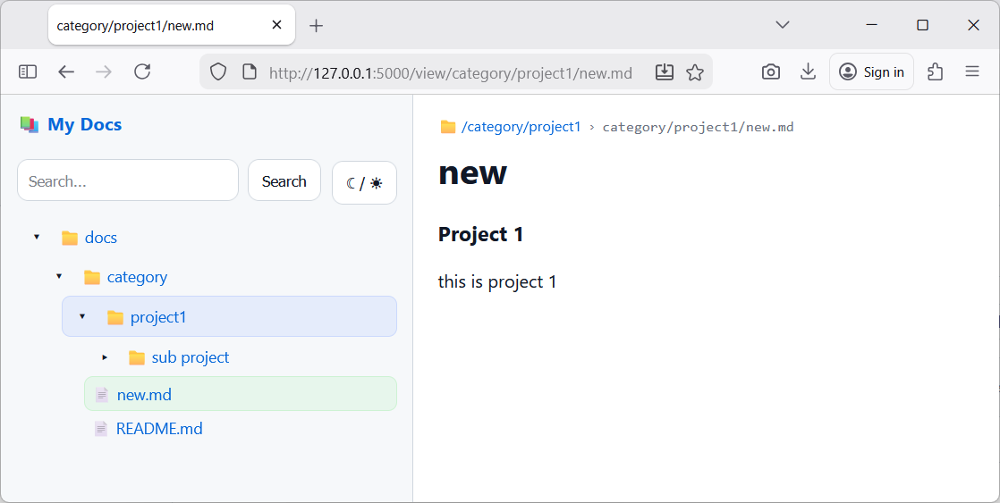

# My Docs

A tiny Flask app to browse and render Markdown documentation from the `./docs/` folder in a clean web UI.

- Recursive folder tree sidebar (expand/collapse; state saved in browser)
- Folder opens `README.md` by default (if present)
- GitHub-like Markdown rendering (tables, fenced code, task lists, autolinks, strikethrough, emoji)
- Light/Dark theme toggle

## Quick start

### 1) Clone

```bash
git clone https://github.com/rintoprie/mydocs.git
cd mydocs
```

### 2) Create a virtual environment (recommended)

**Linux/macOS**
```bash
python3 -m venv .venv
source .venv/bin/activate
```

**Windows (PowerShell)**
```powershell
py -m venv .venv
.\.venv\Scripts\Activate.ps1
```

### 3) Install requirements

```bash
pip install -r requirements.txt
```

### 4) Put your docs in `docs/`

Example:
```
docs/
  README.md
  project-a/
    design.md
    notes.md
```

### 5) Run

```bash
python app.py
```

Open: `http://127.0.0.1:5000`

> For access from local network, run Flask on localhost and put Nginx in front (recommended below).

  

## Nginx Basic Auth (recommended)

This keeps Flask unchanged and gates access with a simple whitelist.

### A) Install Nginx + htpasswd tool

**Ubuntu/Debian**
```bash
sudo apt-get update
sudo apt-get install -y nginx apache2-utils
```

### B) Create a whitelist file

```bash
sudo htpasswd -c /etc/nginx/.htpasswd alice
sudo htpasswd /etc/nginx/.htpasswd bob
```

### C) Ensure Flask binds to localhost

In `app.py` we run:
- host: `127.0.0.1`
- port: `5000`

Start Flask:
```bash
python app.py
```

### D) Configure Nginx reverse proxy + Basic Auth

Create a site config:

```bash
sudo nano /etc/nginx/sites-available/my-docs
```

Paste:

```nginx
server {
  listen 80;
  server_name _;

  location / {
    auth_basic "My Docs";
    auth_basic_user_file /etc/nginx/.htpasswd;

    proxy_pass http://127.0.0.1:5000;
    proxy_set_header Host $host;
    proxy_set_header X-Real-IP $remote_addr;
    proxy_set_header X-Forwarded-For $proxy_add_x_forwarded_for;
    proxy_set_header X-Forwarded-Proto $scheme;
  }
}
```

Enable + restart:

```bash
sudo ln -s /etc/nginx/sites-available/my-docs /etc/nginx/sites-enabled/my-docs
sudo nginx -t
sudo systemctl restart nginx
```

Access from the local network:

```
http://<server-ip>/
```

---

## Notes

- Folder tree open/close state is stored in `localStorage`.
- If you edit lots of docs while the server is running, restart Flask to refresh the sidebar tree.

---

## Preview

  
